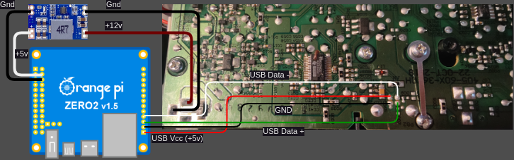
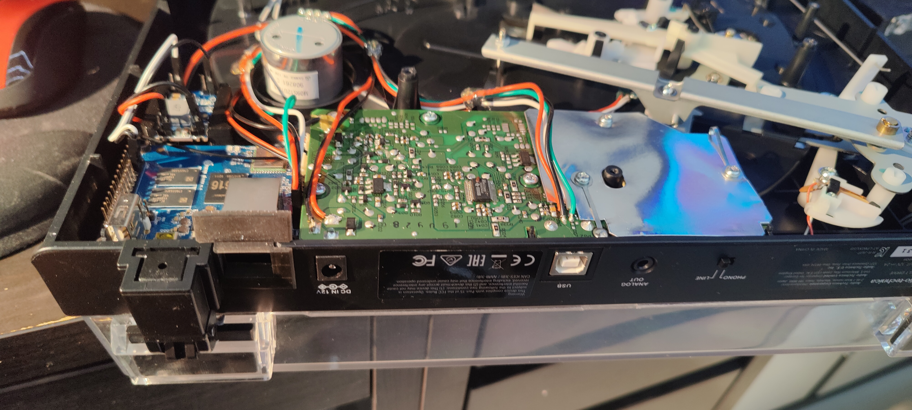

# PCM to Chromecast

## Problems

I have vinyl player by Audio-Technica (model AT-LP60XUSB) which outputs audio
streams via jack port or USB PCM. And I have now soundbar JBL500, which supports
none of this carriers.

## Solution

I decided to use one of my cheap Orange PI Zero2 PC to transfer audio data from
USB PCM to soundbar via chromecast.

## Software

I used my [fork](https://github.com/ein-shved/swyh-rs)
[swyh-rs](https://github.com/dheijl/swyh-rs) for audio streaming server and
`pychromecast` to control soundbar.

The NIX build system is used to build ready-to-use firmware.

### Building

[Install nix](https://nixos.org/download/) if you do not have one and run

```bash
nix build github:ein-shved/pcm-chromecast#firmware
```

This command will place the symlink `result` to your current work directory and
firmware withing path `result/sd-image/`.

### Flashing

Flash firmware to sd card with command

```bash
sudo dd if=result/sd-image/nixos-sd-image-*-aarch64-linux.img \
        of=/dev/<your_sdcard_device>
```

### Usage

Put sd card to your Orange PI Zero2 PC and power it on. It will search and use
first available chromecast audio player in local ethernet network, to play audio
from USB plugged-in pcm.

## Soldering

Here the scheme of connecting mini PC to vinyl player's board with powering it
from its +12v input via mini560 dc-dc step-down.




## Placing

I've 3d-printed (with FFF PetG) the [holder](./models/Holder.m3d.stp) to place
PC inside player's case. The holder is glued to case and PC can screw to it with
using of fused nuts.

Additionally, I needed to cut the opening in cast ethernet port. I 3d-printed
the [frame](./models/EthernetFrame.m3d.stp) with SLA to cover the cat.

Here is the final look of assembled upgrade.




